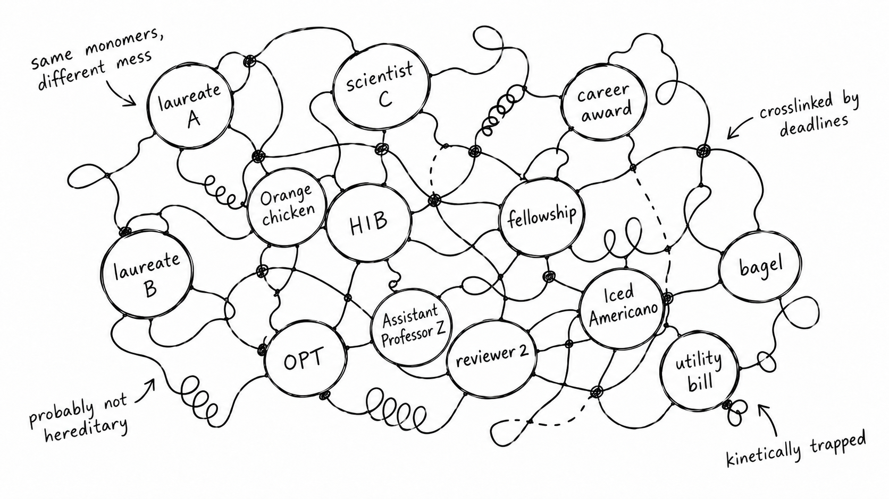

## The Pedigree Hypothesis

Academia has a peculiar fascination with pedigree.

We ask where someone did their PhD, who their advisor was, whose advisor that advisor was, and, given enough coffee, we can usually reconstruct a family tree reaching several generations back. Some branches are impressively decorated: famous institutions, famous laboratories, famous names, perhaps even a Nobel laureate somewhere upstream.

This lineage is not entirely silly. Ideas and projects travel through people. Experimental techniques pass from one laboratory to another. Advisors introduce students to collaborators, collaborators introduce them to future employers, and a familiar name on a recommendation letter can make a door considerably easier to open.

A simple model for the production of scientists might therefore look like:

**scientist → student → scientist → student → scientist**

Accordingly, scientists should arise predominantly near existing concentrations of scientists. MIT, Harvard, and other big-name schools should produce scientists. The great lineages should reproduce themselves generation after generation.

One occasionally encounters beautifully tidy diagrams of this idea: Curie, Perrin, de Gennes, another big name, a student, and perhaps the student\'s future students---all connected by one continuous academic bloodline.

Very elegant.

Their descendants should then diffuse outward, establish new laboratories, train more students, and so on. We might even write down a flux:

$$
J = -D\nabla c
$$

where c is the local concentration of scientists and D is some poorly defined academic diffusion coefficient involving fellowships, recommendation letters, conference dinners, and the willingness to move to another continent for a postdoc.

This would be bad news for everyone born outside the family tree.

Fortunately, the model fails almost immediately.

## Active Particles

Unfortunately, humans are active particles.

They do not diffuse down gradients of prestige, opportunity, or expectation. They self-propel. And this creates a problem for the pedigree hypothesis: the scientist phenotype does not breed true.

A great scientist may train a student who becomes another great scientist. But the student may also become a consultant, an entrepreneur, a software engineer, a high-school teacher, a musician, or a very happy person who discovers that they never particularly liked research in the first place.

Scientific ancestry is neither necessary nor sufficient. The reverse direction is even more damaging to the pedigree hypothesis that scientists routinely appear where no obvious scientific ancestry can be found. Before putting on a lab coat, one future scientist might have been doing manual work at a petroleum complex. Another might have sat through an unbearably dull internship at a semiconductor company and concluded that whatever he wanted from life, this could not possibly be it. Another might have spent a winter repairing frozen pipes in a state key laboratory with broken AC, serving as its unofficial plumber. They can enter the field with occasional "de-recommendations". They are not always invited.

One scientific lineage may descend from the laureate(s).

Another may begin with an assistant professor who barely survived the tenure process, fought desperately to keep his lab alive, and nevertheless managed to convince a student that doing science was worth the damn trouble.

It is not obvious which lineage will produce the better scientists.

Pedigrees are supposed to make predictions easier.

Science refuses to cooperate.

## The Locked Door

There is another kind of lineage, harder to name: the transmission of the conviction that a question can be attacked, that an unfamiliar field can be entered, and that a closed door is a physical object rather than a divine commandment.

Suppose you arrive at a door.

The door is locked.

A bad scientist tells you:

**The door is locked.**

This statement may be perfectly correct.

A good scientist tells you how the lock works.

There is a cylinder, several pins of different heights, a shear line, a spring-loaded mechanism, and a particular range of configurations in which rotation becomes possible.

Now the impossibility has become a mechanism.

That is already a great improvement.

An even better scientist brings a screwdriver.

Someone with a slight engineering tendency may remove the hinges.

And while a group of physicists are still standing in front of the door discussing the height of the energy barrier, somebody eventually throws a brick through the window.

This is a nonequilibrium process.

It is inelegant, but it works.

## Initial Conditions

Many barriers in science are real.

There are prestigious institutions, powerful networks, expensive instruments, famous advisors, selective fellowships, recommendation letters, immigration restrictions, and differences in money, geography, language, luck, and timing.

Some people are handed a key.

Some know the person who installed the lock.

Some arrive already knowing that the door exists.

Others encounter the same door without a key, without a map, and occasionally without anyone willing to confirm that there is anything interesting on the other side.

It would be dishonest to pretend that these initial conditions do not matter because they do.

But an initial condition is not a boundary condition.

People inject active forces into the system.

They change direction.

They cross disciplines.

They meet someone unexpectedly.

They read one paper at the right time.

They become bored.

They become indignant.

They fail at one thing and become curious about another.

They move to another country.

They ask a question for which they have absolutely no formal qualification, and then spend several years becoming qualified to answer it.

Noise matters.

Collisions matter.

Rare events matter.

Self-motivation matters.

## Horizontal Transfer

So perhaps scientific "blood" exists after all.

But it behaves more like horizontal gene transfer.

A way of thinking can jump between unrelated people.

Someone at MIT may transmit it.

Someone at UIUC may transmit it.

Someone at IBS in Korea may transmit it.

Someone at UMass may transmit it.

It may even begin at ZJU---not in a lab, but in an old warehouse tucked into a small corner of campus, with mice regularly scurrying overhead.

It may pass through the student of a Nobel laureate.

It may also pass through an assistant professor whose academic career nearly ended before it properly began.

Curiosity can jump.

Courage can jump.

Standards can jump.

So can the habit of looking at an apparently impossible problem and asking a slightly different question:

**Why, exactly, is it impossible?**

That may be the most important inheritance a scientist can leave.

Academic pedigree tells us where someone came from.

It does not tell us where someone is allowed to go.

```{=html}
<figure class="academic-figure">
  <div class="academic-figure-image">
    
    <span class="artwork-credit">Artwork by ChatGPT; any faults are its own.</span>
  </div>
  <figcaption>Not a grand lineage. Just a rather boring polymer.</figcaption>
</figure>
```

*And to the stranger who made it this far: may you find your door, your window, or, if necessary, a good screwdriver.*

--- Xinyu

*Amherst, Massachusetts*

*September 2026*
